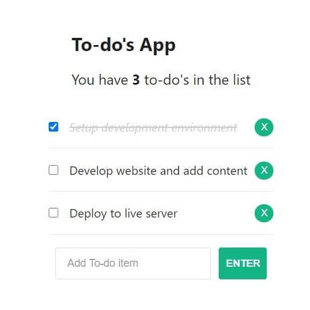

# To Do List
<table>
<tr>
<td>
  A simple to-do list app built using React.Js library. There user can add new to-dos, strike them out or delete at all.
</td>
</tr>
</table>

# 

## Website 

Here is a working [To Do List](https://laura.jaks.info/to-do/).

## Built with 

- [Create React App](https://github.com/facebook/create-react-app) - simplified tool when building React apps.